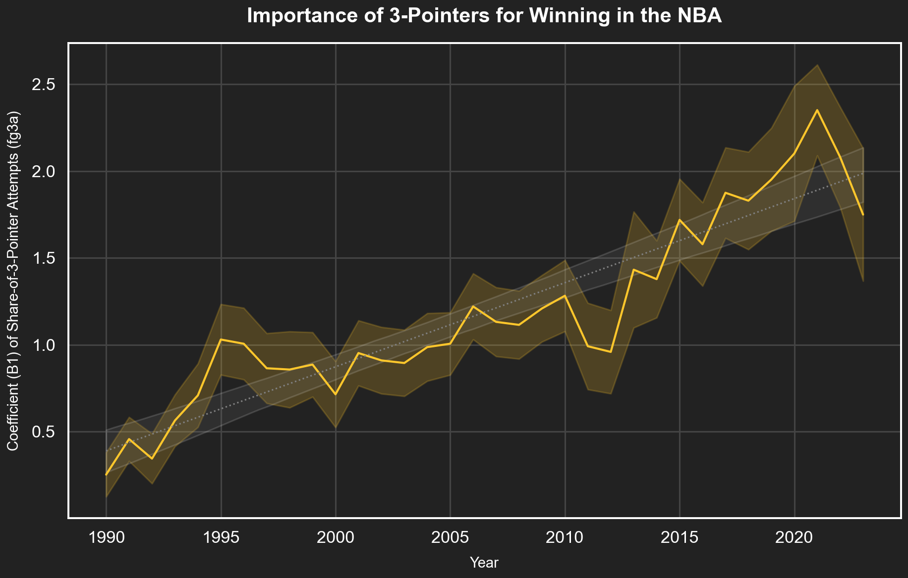
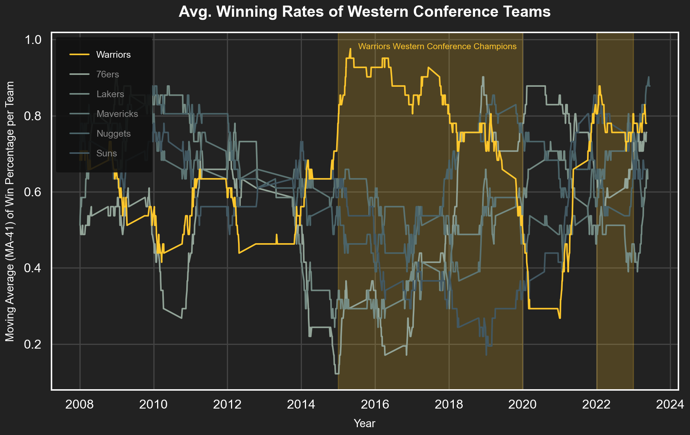
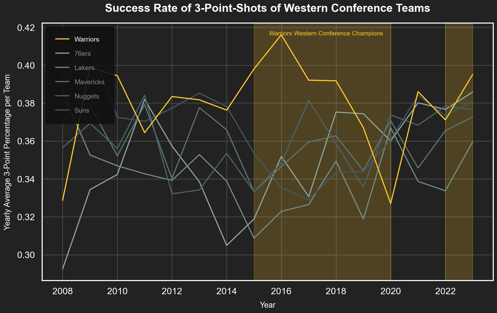

<sup> Below you find the answer to exercise 3, PS2, D100. While the author is fully aware of the relevance of testing and documentation, these steps were ommitted due to the factor of time. </sup>

# NBA Data-Insights
## The remarkable story of the rise of the 3-point shot
In the last 30 years of the NBA, the 3-point shot became increasingly popular. At the forefront of this rise stands Steph Curry, the baby-faced assasin from the Golden States Warriors. Few have made the 3-point focused playing style look so appealing as Curry. However, the 3-point shot has been on the rise long before Curry's first appearance (in 2009 with the Warriors). This notebook examines the story of the 3-point shot using four insights drawn from NBA data.

## Preparation
To prepare the notebook, the necessary module need to to be imported.


```python
import sqlite3 as sql
from pathlib import Path
import nba.s01_data_wrangling as dw
import nba.s02_data_visualisation as dv
import warnings
warnings.filterwarnings("ignore")
```

    Intel MKL WARNING: Support of Intel(R) Streaming SIMD Extensions 4.2 (Intel(R) SSE4.2) enabled only processors has been deprecated. Intel oneAPI Math Kernel Library 2025.0 will require Intel(R) Advanced Vector Extensions (Intel(R) AVX) instructions.
    Intel MKL WARNING: Support of Intel(R) Streaming SIMD Extensions 4.2 (Intel(R) SSE4.2) enabled only processors has been deprecated. Intel oneAPI Math Kernel Library 2025.0 will require Intel(R) Advanced Vector Extensions (Intel(R) AVX) instructions.


A connection is subsequently established to the NBA database which hosts the data from which the insight are derived.


```python
DATA_PATH = Path.cwd() / 'data/nba.sqlite'
con = sql.connect(DATA_PATH)

```

## 1. Insight: Attempting 3-pointers is a winning strategy

We aim to examine whether attempting more 3-point shots makes winning more or less likely. To investigate this, we set up the following linear regression model:

$$
GameWon = B_0 + B_1 * fg3a
$$

- **GameWon**: A binary variable (0 or 1) indicating whether the team won (1) or lost (0).
- **fg3a**: The share of attempted shots that were 3-point attempts.

We run this regression for each year between 1990 and 2023 to obtain the coefficient (B1), showing how much 3-pointers contribute towards winning the game.


```python
# Load all games from the database
games = dw.select_games(con)
# Clean the data to get our regression data
data = dw.create_fg3a_data(games)
# Run the regressions for the years 1990 - 2023
regression_results = dw.run_regressions(data)
```

Having obtained the data, we create a time series plot indicating the value of the coefficient B1. The boundaries around the mean line show the 95%-standard-error band.


```python
args = {
    'data': regression_results,
    'y': 'fg3a_share_coefficient',
    'x': 'year',
    'se_min': 'se_min',
    'se_max': 'se_max',
    'regression': True,
    'title': 'Importance of 3-Pointers for Winning in the NBA',
    'xlabel': 'Year',
    'ylabel': 'Coefficient (B1) of Share-of-3-Pointer Attempts (fg3a)',
    'linecolor': '#FFC72C'
}
dv.time_series_plot(**args)
```





**Insight:** The graph clearly demonstrates how the 3-point shot became increasingly more important for winning over the last 30 years throughout the entire NBA.

# 2. Insight: NBA players slowly become better at shooting 3-pointers

With the 3-point shot becoming increasingly more relevant, one would expect that players also work on improving their 3-point shot. To test this, we examine how the success rate of 3-pointers (*three-point field goal efficacy*) changed since 1990.


```python
# Obtain the data containing the average 3-point shot success rate.
data = dw.get_avg_fg3_data(con)
print(data)
```

        year  avg_fg3_pct_home
    0   1990          0.317299
    1   1991          0.322949
    2   1992          0.326947
    3   1993          0.331657
    4   1994          0.337036
    5   1995          0.366420
    6   1996          0.366200
    7   1997          0.351111
    8   1998          0.350446
    9   1999          0.340775
    10  2000          0.354616
    11  2001          0.356668
    12  2002          0.358416
    13  2003          0.351251
    14  2004          0.349726
    15  2005          0.351323
    16  2006          0.351908
    17  2007          0.358708
    18  2008          0.357256
    19  2009          0.360811
    20  2010          0.357139
    21  2011          0.351266
    22  2012          0.345690
    23  2013          0.350415
    24  2014          0.355338
    25  2015          0.348817
    26  2016          0.360740
    27  2017          0.364909
    28  2018          0.359007
    29  2019          0.358599
    30  2020          0.363308
    31  2021          0.362572
    32  2022          0.357520
    33  2023          0.366783


Having loaded in the data, we visualise the success rate using a time series plot.


```python
# Visualise the data using a time series plot
args = {
    'data': data,
    'x': 'year',
    'y': 'avg_fg3_pct_home',
    'title': 'Success Rate of 3-Point-Shots in the NBA',
    'xlabel': 'Year',
    'regression': True,
    'ylabel': 'Average 3-Point NBA Percentage per Year',
    'linecolor': '#FFC72C'
}
dv.time_series_plot(**args)
```


**Insight:** Players clearly became better at shooting 3-pointers in the 90ies. However, since the early 2000s, players only slowly improve their 3-point shots.

# 3. Insight: Curry's Golden State Warriors dominated the Western Conference

The aforementioned Steph Curry, famous for his 3-point shot, plays since 2009 for the Golden State Warriors. The Golden State Warriors are interesting, as for 4 years in a row (between 2015-2019) they won the Western Conference.

To track the dominance of the Warriors, we examine the win percentage of various Western Conference team using an MA(41) moving average process.

$$ Win Percentage MA(41) = \frac{1}{41}\sum^{41}_{i}(GameWon_{i})$$

- **GameWon**: A binary variable (0 or 1) indicating whether the team won (1) or lost (0).

In a next step, we load the data for the Warriors and some other Western Conference teams.

<sup>Footnote: We are using an MA(41) process, as a regular NBA season consists of 82 games per team. Since we only track home games (i.e., half of all games), an MA(41) process provides the win percentage of a team across "one season"—or, in this case, the most recent 41 games.</sup>


```python
# Select the Western Conference Teams to analyse
teams = ["Warriors", "Lakers", "76ers", "Suns", "Nuggets", "Mavericks"]

# Add an MA41 column to the data
data = dw.get_ma41_data(con)
data = dw.clean_ma_data(data, teams)

print(data)
```

              team_id     game_id       date  win  team_name  ma_41
    12498  1610612742  0020800341 2008-12-13    1  Mavericks  0.707
    12499  1610612742  0020800356 2008-12-15    0  Mavericks  0.683
    12500  1610612742  0020800418 2008-12-23    1  Mavericks  0.683
    12501  1610612742  0020800463 2008-12-30    1  Mavericks  0.683
    12502  1610612742  0020800483 2009-01-02    1  Mavericks  0.683
    ...           ...         ...        ...  ...        ...    ...
    44115  1610612756  0042200172 2023-04-18    1       Suns  0.659
    44116  1610612756  0042200175 2023-04-25    1       Suns  0.659
    44117  1610612756  0042200223 2023-05-05    1       Suns  0.659
    44118  1610612756  0042200224 2023-05-07    1       Suns  0.659
    44119  1610612756  0042200226 2023-05-11    0       Suns  0.659

    [4032 rows x 6 columns]


```python
# We visualise the data as a time series plot grouped by team
args = {
    "data": data,
    "x": "date",
    "y": "ma_41",
    "group_by": "team_name",
    "title": "Avg. Winning Rates of Western Conference Teams",
    "xlabel": "Year",
    "ylabel": "Moving Average (MA-41) of Win Percentage per Team",
    "main_team": "Warriors",
    "linecolor": "#FFC72C",
    "championship_years": [(2015, 2019), (2022, 2022)]
}

dv.multi_team_visualisation(**args)
```





**Insight:** Between 2015 and 2019, the Warriors were the dominant team in the Western Conference and won almost all of their games.

# 4. Insight: When the Warriors were dominant, they hit as many 3-pointers as none other

It was established that the Warriors had some very successful years between 2015 and 2019. An interesting question to ask, is whether in their dominant period, the Warriors were also better at shooting 3-pointers.

To answer the question, the data is loaded first.


```python
# Load the data of average 3-point shot success rate per team
data = dw.get_3pt_success_rate(con, teams)
print(data)
```

              year team_nickname  avg_fg3_pct_home
    0   2008-01-01         76ers          0.292500
    1   2009-01-01         76ers          0.334370
    2   2010-01-01         76ers          0.342318
    3   2011-01-01         76ers          0.382000
    4   2012-01-01         76ers          0.357395
    ..         ...           ...               ...
    427 2019-01-01      Warriors          0.367082
    428 2020-01-01      Warriors          0.327000
    429 2021-01-01      Warriors          0.386103
    430 2022-01-01      Warriors          0.371125
    431 2023-01-01      Warriors          0.395172

    [96 rows x 3 columns]


```python
# Visualise the data using a time series plot grouped by team
args = {
    "data": data,
    "x": "year",
    "y": "avg_fg3_pct_home",
    "group_by": "team_nickname",
    "title": "Success Rate of 3-Point-Shots of Western Conference Teams",
    "xlabel": "Year",
    "ylabel": "Yearly Average 3-Point Percentage per Team",
    "main_team": "Warriors",
    "linecolor": "#FFC72C",
    "championship_years": [(2015, 2019), (2022, 2022)]
}

dv.multi_team_visualisation(**args)
```





**Insight:** The Warrios dominant years coincided with them sucessfully scoring more 3-pointers than any other team


```python
# We close the connection to the database
con.close()
```

## Conclusion
To conclude, the 3-point shot has seen a rising relevance in the NBA over the past 20 years. Its importance for winning games leads teams to continuously improve the 3-pointer skills of their players. A demonstration of the power of the 3-pointer is found in the case of the Golden State Warriors, which dominated the Western Conference and the NBA between 2015 - 2019. One significant factor of their dominance may be attributed to their team's exceptional ability to hit 3-point shots.
